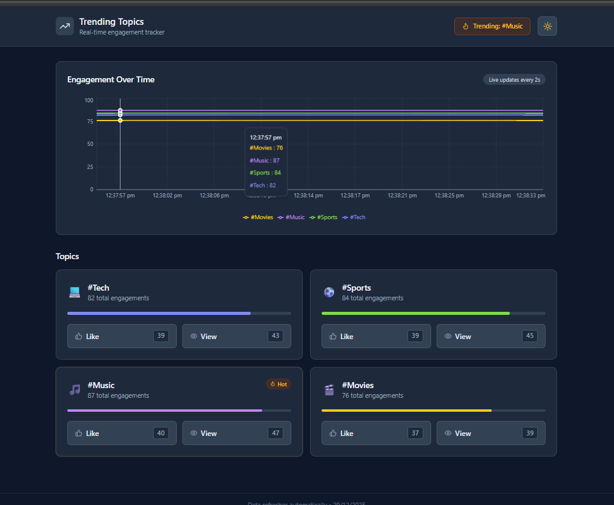
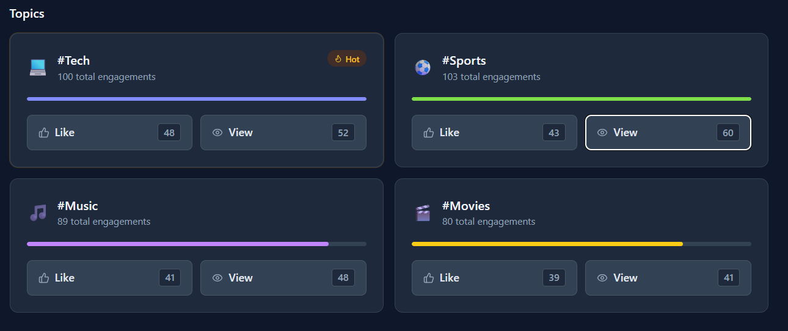

# Live Trending Topics

> A real-time trending topics system inspired by Twitter/Instagram trends

[](https://nodejs.org/)
[](https://socket.io/)
[](https://redis.io/)
[](https://kafka.apache.org/)

---

## Overview

A simple real-time trending topics system where users can like and view predefined topics. All engagement updates happen instantly across connected clients using Socket.IO, while events are logged through Kafka for analytics.

---

## Features

- Predefined trending topics: `#Tech`, `#Sports`, `#Music`, `#Movies`
- Real-time like and view counters
- Instant updates across all connected clients
- Trending calculation based on highest likes
- Event logging with Kafka
- Storage in MongoDB and Elasticsearch for analytics
- Live engagement chart
- Light/Dark theme toggle

---

## Tech Stack

**Frontend:** React, Vite, Socket.IO Client, Tailwind CSS, Recharts

**Backend:** Node.js, Express, Socket.IO, Redis, Kafka

**Data:** MongoDB, Elasticsearch

**Infrastructure:** Docker Compose

---

## How It Works

```
User clicks Like/View
       ↓
Socket.IO emits event
       ↓
Backend updates Redis counter
       ↓
Broadcasts to all clients
       ↓
Sends event to Kafka
       ↓
Consumer stores in MongoDB + Elasticsearch
```

---

## Screenshots

### Main Dashboard


### Real-time Trending Updates


### Engagement Analytics Chart


### Theme Customization


---

## Quick Start

### Prerequisites
- Node.js 18+
- Docker & Docker Compose

### Setup

1. **Start services**
```bash
docker-compose up -d
```

2. **Run backend**
```bash
cd backend
npm install
npm start
```
Backend: `http://localhost:5000`

3. **Run frontend**
```bash
cd frontend
npm install
npm run dev
```
Frontend: `http://localhost:5173`

---

## Redis Keys

```
topic:#Tech:likes
topic:#Tech:views
topic:#Sports:likes
topic:#Sports:views
```

---

## Kafka Events

Each user action generates an event:

```json
{
  "topic": "#Tech",
  "event": "TOPIC_LIKED",
  "timestamp": "2025-01-22T14:32:45.809Z"
}
```

---

## Author

**Naina Kothari**  
GitHub: [@NainaKothari-14](https://github.com/NainaKothari-14)

---

*Built to learn real-time systems, event streaming, and scalable backend design*
